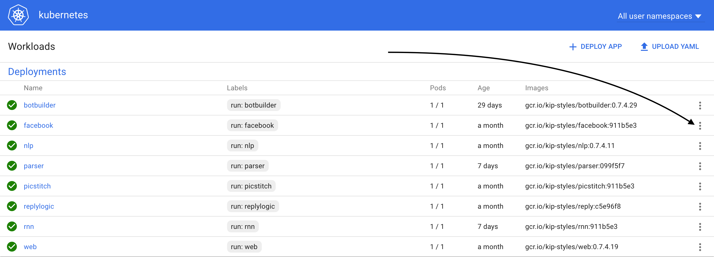
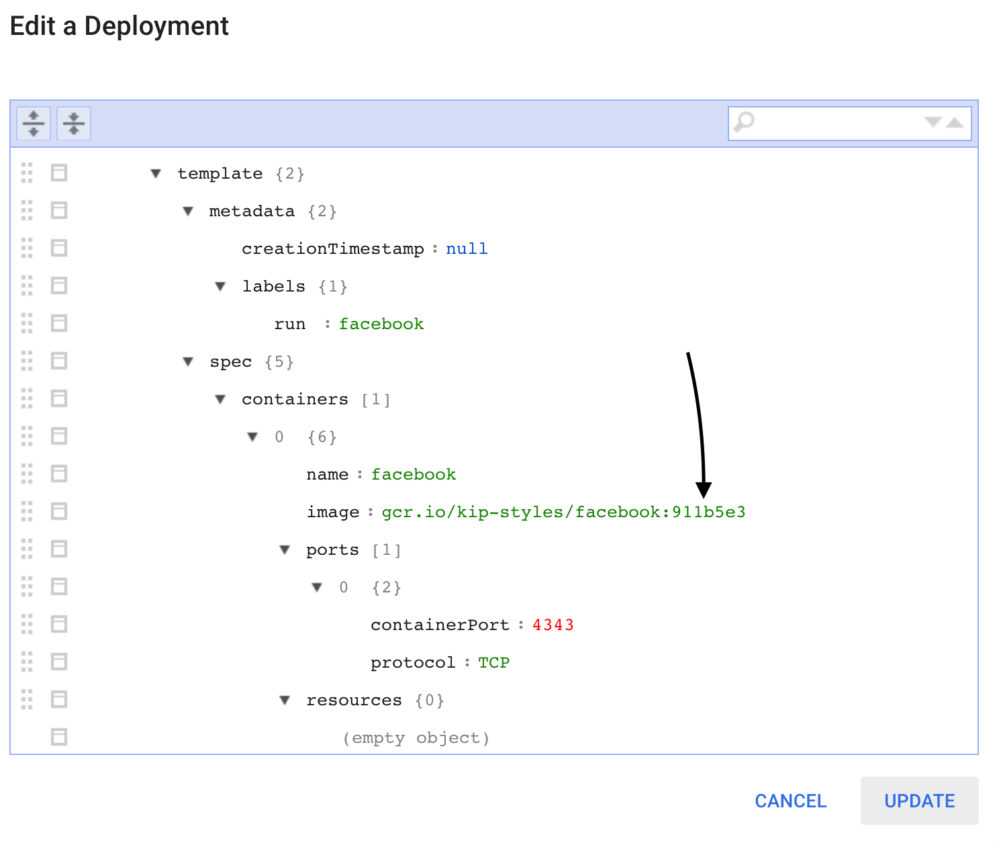
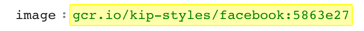

# What this is for
Since the deployments have already been created and setup to talk to each other and talk to the mongodb, this will not deal with that.  This is solely for updating a kubernetes deployment from some image

# Setup

# Build the docker image

To build the docker image for the facebook container for the git commit 5863e27 (this is just a random example for kip use case)

1. cd to src/
2. export VERSION=5863e27
2. docker build -t gcr.io/kip-styles/facebook:$VERSION -f Dockerfiles/facebook.Dockerfile .
3. gcloud docker push gcr.io/kip-styles/facebook:$VERSION

Now the image is in the kip-styles container repo (you would be able to see it [here](https://console.cloud.google.com/kubernetes/images/tags/facebook?location=GLOBAL&project=kip-styles)), you must update the deployment to use the correct image.

To use the web dashboard to update the image you need the web dashboard: login, password, and ip.

1. run `kubectl config view` and look for
```
- name: gke_kip-styles_us-east1-b_kip
  user:
```
there will be a password and username listed.
then enter `kubectl cluster-info` and there will be a url after `kubernetes-dashboard is running at`

Use that url with previous username and password then in the dashboard click the 3 dots on the right side of the *facebook deployment*:


Click the view/edit YAML button, and then scroll down to spec > containers > image:


Update the image tag (the part after the : in a docker image) with the updated version number:
